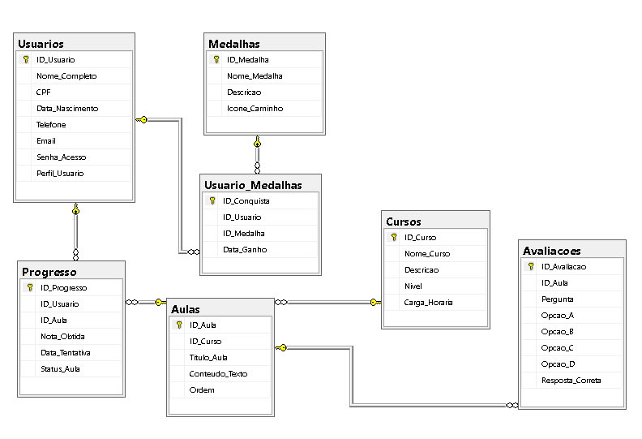

# 📘 Projeto Integrador Multidisciplinar (PIM)

## 📌 Descrição
Este projeto tem como objetivo aplicar na prática os conhecimentos adquiridos ao longo do curso, integrando conceitos de desenvolvimento de software utilizando C#, banco de dados, UX/UI (Experiência e Interface do Usuário) e desenvolvimento web responsivo.

O sistema desenvolvido busca atender às necessidades propostas no desafio, utilizando boas práticas de programação, organização e segurança.

---

## 🎯 Objetivo do Projeto
O objetivo deste PIM é desenvolver um **sistema de ensino-aprendizagem**, que auxilie no processo educacional, facilitando o acesso a conteúdos, organização de estudos e interação entre usuários.

---

## 🚀 Tecnologias Utilizadas
- C#  
- SQL Server  
- Git e GitHub  
- VS Code  
- Figma  
- Astah  

---

## 👥 Metodologia
O projeto foi desenvolvido utilizando conceitos de metodologias ágeis, com organização baseada no Scrum, onde cada integrante possui um papel definido dentro do time.

---

## 🔐 DevSecOps
Foram aplicados conceitos básicos de DevSecOps, garantindo maior segurança e organização no desenvolvimento do projeto.

---

## 📊 Tabela DevSecOps - DevTime

| Nome                              | RA        | Papel no Scrum   | Git Individual                           |
|-----------------------------------|-----------|------------------|------------------------------------------|
| Beatriz Alves de Britto           | R949AI8   | Scrum Master     | https://github.com/beatriz-a-britto      |
| Guilherme José Afonso             | R87606-3  | Desenvolvedor    | https://github.com/Guilhermejs21         |
| Jade Ferreira do Nascimento       | H7876C2   | Product Owner    | https://github.com/jadeferreirans        |
| Luan Victor Costa de Carvalho     | R956288   | Desenvolvedor    | https://github.com/CarvalhoLC            |

---

## 📋 Requisitos do Sistema – LuminaTech

### 🔹 Requisitos Funcionais

#### 👤 Usuário (Aluno)
- RF01: O sistema deve permitir cadastro.  
- RF02: O sistema deve permitir login.  
- RF03: O sistema deve permitir recuperação de senha.  
- RF04: O sistema deve permitir acessar cursos e conteúdos.  
- RF05: O sistema deve permitir realizar atividades.  
- RF06: O sistema deve permitir acompanhar progresso.  
- RF07: O sistema deve permitir gerar certificado.  

#### 👨‍🏫 Professor
- RF08: O sistema deve permitir criar cursos.  
- RF09: O sistema deve permitir postar atividades.  
- RF10: O sistema deve permitir acompanhar desempenho dos alunos.  

#### 🛠️ Administrador
- RF11: O sistema deve permitir gerenciar usuários.  
- RF12: O sistema deve permitir configurar permissões.  

---

### 🔹 Requisitos Não Funcionais
- RNF01: O sistema deve ser responsivo.  
- RNF02: O sistema deve possuir interface intuitiva (UX/UI).  
- RNF03: O sistema deve garantir segurança dos dados.  
- RNF04: O sistema deve ter bom desempenho.  

---

## 🔤 Acrônimos dos Integrantes
- BAB: Beatriz Alves de Britto  
- GJA: Guilherme José Afonso  
- JFN: Jade Ferreira do Nascimento  
- LVC: Luan Victor Costa  

---

## 📌 Product Backlog – LuminaTech

| ID   | Tarefa                                      | Prioridade | Resp. | Status   |
|------|---------------------------------------------|------------|-------|----------|
| PB01 | Criar tela de login                         | Alta       | JFN   | Pendente |
| PB02 | Cadastro de usuário                         | Alta       | BAB   | Pendente |
| PB03 | Recuperação de senha                        | Alta       | GJA   | Pendente |
| PB04 | Estrutura inicial do sistema                | Alta       | LVC   | Pendente |
| PB05 | Sistema de cursos                           | Alta       | JFN   | Pendente |
| PB06 | Trilhas de aprendizagem                     | Média      | BAB   | Pendente |
| PB07 | Sistema de atividades                       | Alta       | GJA   | Pendente |
| PB08 | Área do professor                           | Média      | LVC   | Pendente |

---

## 🚀 Sprint Planning

### 📅 Sprint 1
| ID   | Tarefa                | Resp. | Status   |
|------|----------------------|-------|----------|
| SP01 | Tela de login        | JFN   | Pendente |
| SP02 | Cadastro de usuário  | BAB   | Pendente |
| SP03 | Recuperação de senha | GJA   | Pendente |
| SP04 | Estrutura do sistema | LVC   | Pendente |

---

### 📅 Sprint 2
| ID   | Tarefa                    | Resp. | Status   |
|------|--------------------------|-------|----------|
| SP05 | Sistema de cursos        | JFN   | Pendente |
| SP06 | Trilhas de aprendizagem  | BAB   | Pendente |
| SP07 | Sistema de atividades    | GJA   | Pendente |
| SP08 | Área do professor        | LVC   | Pendente |

---

### 📅 Sprint 3
| ID   | Tarefa                      | Resp. | Status   |
|------|----------------------------|-------|----------|
| SP09 | Progresso do aluno         | JFN   | Pendente |
| SP10 | Certificados               | BAB   | Pendente |
| SP11 | Painel administrativo      | GJA   | Pendente |
| SP12 | Responsividade             | LVC   | Pendente |

---

## 🗄️ Banco de Dados – LuminaTech

O projeto utiliza um banco de dados desenvolvido no SQL Server, responsável por armazenar e gerenciar todas as informações do sistema.

### 📁 Estrutura

```bash
database/
 ┣ LuminaTech.sql
 ┗ modelo.png
```

### ⚙️ Como executar o banco de dados

1. Abra o SQL Server Management Studio (SSMS)
2. Clique em **New Query (Nova Consulta)**
3. Abra o arquivo `database/LuminaTech.sql`
4. Execute o script clicando em **Execute ▶️**

### 📊 Modelo do Banco de Dados



---
 ## 📂 Estrutura do Projeto

- 🗄️ [Database](database/)
- 📊 [DevSecOps](devsecops/README.md)
- 📌 [Backlog](backlog/README.md)
- 🚀 [Sprint Planning](sprint-planning/README.md)
---

## 💡 Observações
Este projeto foi desenvolvido para fins acadêmicos, com o objetivo de consolidar o aprendizado prático nas disciplinas do curso.
